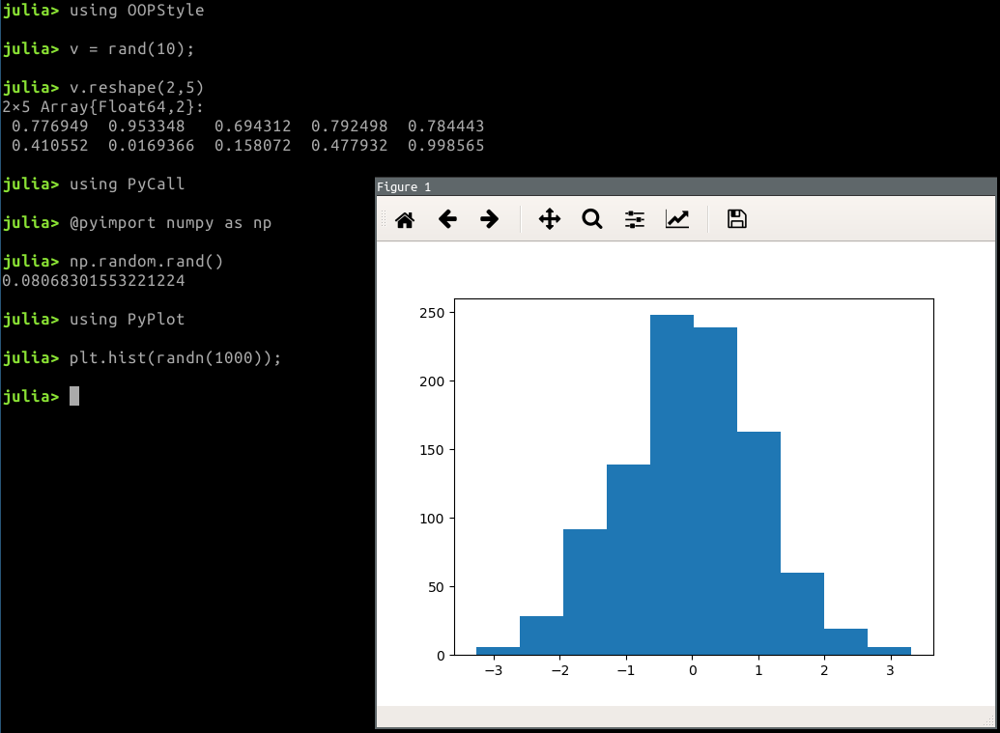

# OOPStyle

[](https://travis-ci.org/goropikari/OOPStyle.jl)
[](https://ci.appveyor.com/project/goropikari/OOPStyle-jl)
[](https://codecov.io/gh/goropikari/OOPStyle.jl)
[](https://coveralls.io/github/goropikari/OOPStyle.jl?branch=master)




Only for PyObject: [PySyntax2.jl](https://github.com/goropikari/PySyntax2.jl)

# Installation
From package mode
```julia
(v1.0) pkg> add https://github.com/goropikari/OOPStyle.jl
```
or
```julia
using Pkg
Pkg.pkg"https://github.com/goropikari/OOPStyle.jl"
```
